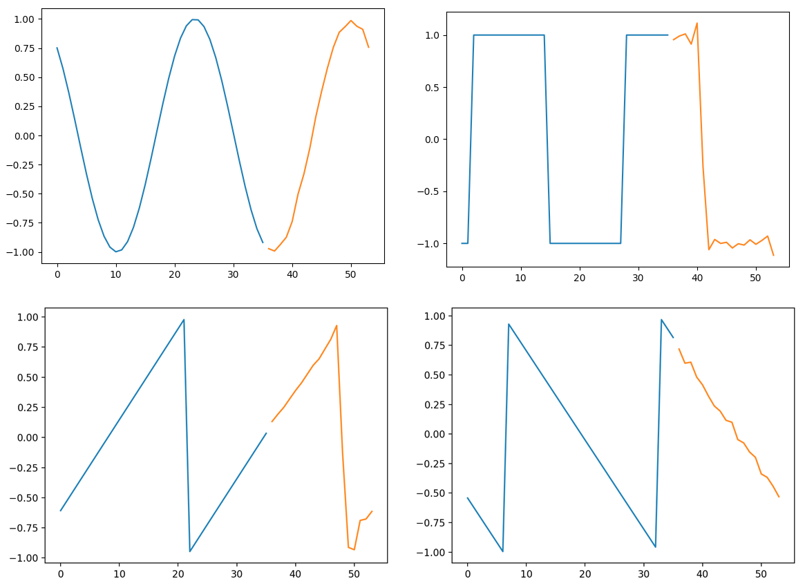

This is a minimal example demonstrating an RNN that accepts sequences of
variable length during training and during inference. The data generated 
is a even split of sine, sawtooth, and square waveforms. The model predicts
a specified number of subsequent points in the sequence. Samples need to 
be of the same length within a single batch. But each batch can have samples
with different lengths. Data must be 2D (sample num, time, data).

Example of RNN model predicting 18 points into the future:

